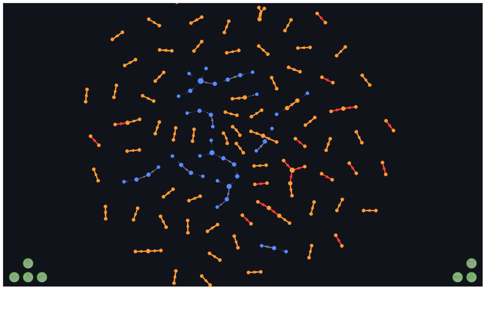
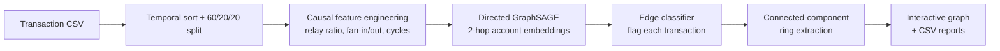
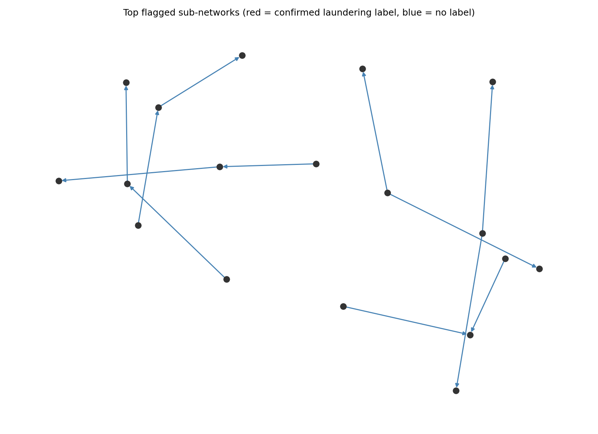

# 🕸️ Graph-Based AML & Fraud Network Detection

[](https://github.com/USERNAME/REPO/actions/workflows/smoke-test.yml)
[](LICENSE)
[](https://www.python.org/downloads/)

A local, dependency-light pipeline that detects money-laundering rings and coordinated
fraud by modeling **bank accounts as nodes and transfers as directed edges**, instead of
scoring each transaction in isolation the way rule engines do.

A 2-hop **directed GraphSAGE** graph neural network learns each account's role in the
network (relay, hub, mule, source, sink) and classifies every transaction as suspicious or
not. A gradient-boosting baseline trained on the same features runs alongside it, so you
can see whether the graph actually earns its keep on your data. Results can be explored as
an interactive, draggable network graph in your browser.

<p align="center">
  
  <br><em>Interactive view of flagged transfers — red = confirmed laundering label, orange = high model risk, blue = lower risk.</em>
</p>

## Why graphs, not just rules

Traditional fraud rules look at one transaction at a time: amount, location, velocity.
Laundering rings are defined by *structure* — money that cycles back to its source through
intermediaries, funds that scatter across mule accounts and regather at a sink, accounts
that forward on almost exactly what they just received. None of that is visible from a
single row of a spreadsheet. This project builds the account graph explicitly and lets a
GNN learn those multi-hop patterns directly.

## Features

- **Edge classification GNN** — directed GraphSAGE (separate in/out neighborhood
  aggregation, since the direction money moves matters) with an MLP edge head
- **No look-ahead leakage** — strict temporal train/val/test split; node features and the
  message-passing graph for each split only see transactions up to that point
- **Tabular baseline included** — a gradient-boosting model on the same features, trained
  without any graph structure, so the GNN's contribution is measurable, not assumed
- **Imbalance-aware evaluation** — PR-AUC, precision@k, and recall at a chosen alert
  budget, since laundering is typically <1% of transactions and plain accuracy is misleading
- **Ring extraction** — connected components of flagged transactions, with cycle detection
  and total exposure, written out as a ranked CSV
- **Interactive graph viewer** — a draggable, zoomable, hoverable network view you open in
  any browser, no server required
- **Runs anywhere** — CPU by default, auto-detects CUDA or Apple Silicon (MPS)

## Quickstart

```bash
git clone https://github.com/USERNAME/REPO.git
cd REPO
pip install -r requirements.txt

# 1. Smoke test on synthetic data with planted laundering rings (~30s on CPU)
python aml_gnn.py --demo

# 2. See the result as an interactive graph
python visualize_graph.py --run runs/aml
# -> open runs/aml/graph.html in your browser
```

That's the whole loop. No dataset download, no GPU, no account/API key needed to try it.

## Running on real data

This project targets the public **[IBM "Transactions for Anti Money Laundering" dataset](https://www.kaggle.com/datasets/ealtman2019/ibm-transactions-for-anti-money-laundering-aml)**
(Kaggle, `ealtman2019`) — simulated but realistic, and the standard benchmark for this task.

```bash
# Download HI-Small_Trans.csv (or LI-Small_Trans.csv) from the Kaggle link above
python aml_gnn.py --data HI-Small_Trans.csv --max-rows 2000000 --out runs/hi_small
python visualize_graph.py --run runs/hi_small
```

Using your own transaction data instead: edit the `COLMAP` dictionary at the top of
`aml_gnn.py` to match your column names. It needs a timestamp, sender and receiver
bank/account, amount, currency, payment type, and a 0/1 laundering label.

<details>
<summary><b>All CLI flags</b></summary>

**`aml_gnn.py`**

| Flag | Default | Description |
|---|---|---|
| `--data` | — | path to the transactions CSV |
| `--demo` | off | generate and use synthetic data instead |
| `--max-rows` | 2,000,000 | cap on rows read; `0` = all rows (needs 16GB+ RAM) |
| `--window-days` | 5 | trailing time window used to build node features and the graph |
| `--hidden` | 64 | GNN hidden dimension |
| `--epochs` | 400 | max training epochs (early stops on validation PR-AUC) |
| `--neg-ratio` | 20 | negative samples per positive per training step |
| `--no-cycles` | off | skip the 3-cycle node feature (saves RAM/time) |
| `--no-baseline` | off | skip the gradient-boosting baseline |
| `--out` | `runs/aml` | output directory |

**`visualize_graph.py`**

| Flag | Default | Description |
|---|---|---|
| `--run` | *(required)* | the `aml_gnn.py` output folder to visualize |
| `--ring` | — | draw only this one `ring_id` from `ring_candidates.csv` |
| `--max-rings` | 15 | how many top-ranked rings to include |
| `--min-edges` | 2 | skip clusters smaller than this |
| `--max-edges-per-ring` | 80 | trims a cluster to its highest-risk edges past this size, so one busy hub account can't drag unrelated clusters into an unreadable hairball |

</details>

## How it works



1. **Graph construction** — accounts become nodes, transfers become directed edges, sorted
   by time.
2. **Causal features** — per-account profile (degree, volume, pass-through ratio, directed
   3-cycle count) and per-transaction features (relay timing, amount-conservation, fan
   patterns) are computed using only information available *before* that transaction, inside
   a trailing window — never from the full dataset, which would leak the future into the past.
3. **Model** — a 2-hop directed GraphSAGE produces an embedding per account from its
   in- and out-neighborhoods separately; an MLP head combines both endpoints' embeddings
   with the transaction's own features to score it.
4. **Evaluation** — scored strictly on a held-out *future* time slice, against PR-AUC,
   precision@k, and recall — the metrics that matter when positives are rare.
5. **Ring extraction & visualization** — flagged transactions are grouped into connected
   components (candidate rings), checked for cycles, and rendered as an interactive graph.

## Example output

| File | What it contains |
|---|---|
| `metrics.json` | PR-AUC, ROC-AUC, precision, recall, F1, precision@k for the GNN and baseline |
| `flagged_transactions.csv` | top 5,000 scored test transactions |
| `ring_candidates.csv` | connected clusters of flagged transfers — size, total $, cycle flag |
| `graph.html` | interactive network view (via `visualize_graph.py`) |
| `flagged_rings.png` | static snapshot of the top 6 rings |
| `model.pt` | trained weights, decision threshold, feature scalers |

<p align="center">
  
</p>

## Design notes

- **No look-ahead leakage** is the single easiest thing to get wrong in this kind of model.
  Node degree/volume features must only reflect history available at prediction time —
  computing them over the whole dataset (including the future) will make validation
  numbers look great and production numbers collapse. This project enforces it with a
  trailing time window recomputed per split.
- **Scores are not calibrated.** Training balances positives against sampled negatives each
  step, so treat scores as a ranking signal (use `--max-rings`/thresholds to pick an alert
  budget), not as a literal probability of laundering.
- **The synthetic demo is a pipeline check, not a benchmark.** Its planted patterns are
  largely visible from a single edge, so the tabular baseline tends to win there. Graph
  structure pays off on data where laundering is only visible across multiple hops — run
  on the real IBM dataset (or your own) to get a meaningful comparison, and consider
  feeding GNN embeddings into the baseline model as a next step if the baseline still wins.

## Project structure

```
.
├── aml_gnn.py              # training + evaluation pipeline (GNN + baseline)
├── visualize_graph.py      # turns results into an interactive graph.html
├── requirements.txt
├── docs/images/             # README screenshots
└── .github/workflows/       # CI smoke test on synthetic data
```

## Limitations & responsible use

- The IBM dataset is simulated. Real institutional data needs its own confirmed labels
  (SARs, closed cases), which are sparse and biased toward whatever the existing rule
  engine already caught — plan for that when evaluating on live data.
- This is a **screening aid for investigator triage, not a legal or compliance
  determination.** Keep a human in the loop on every flagged account, and evaluate
  false-positive cost and fairness across customer segments before any production use.

## Contributing

Issues and PRs are welcome — see [CONTRIBUTING.md](CONTRIBUTING.md). The CI workflow runs
the full pipeline on synthetic data on every push, so most regressions get caught
automatically.

## License

[MIT](LICENSE)
